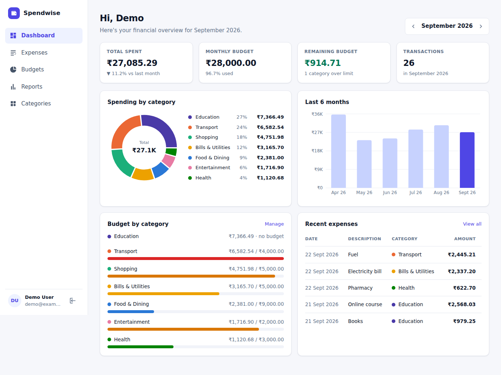
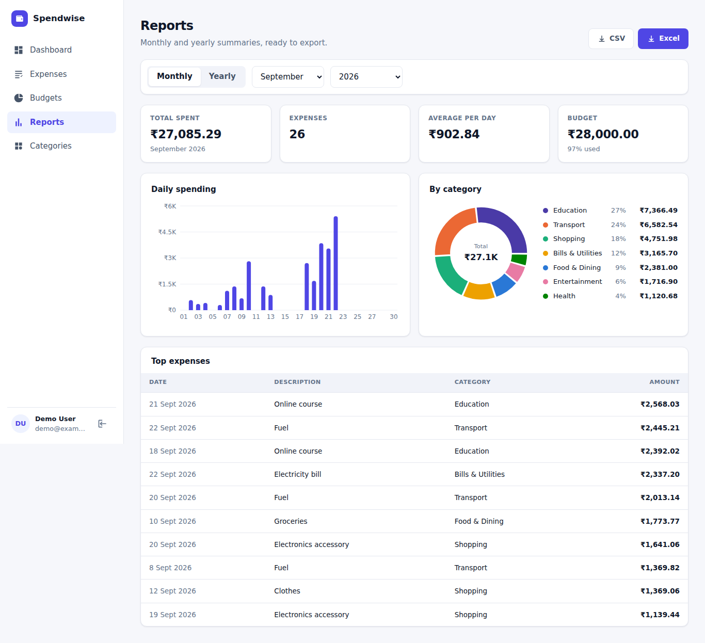
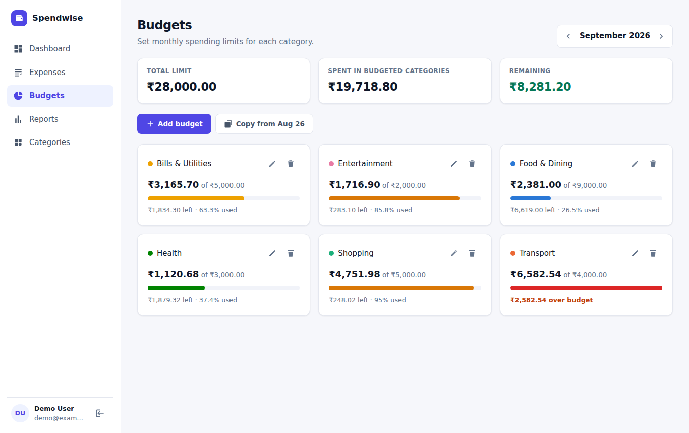
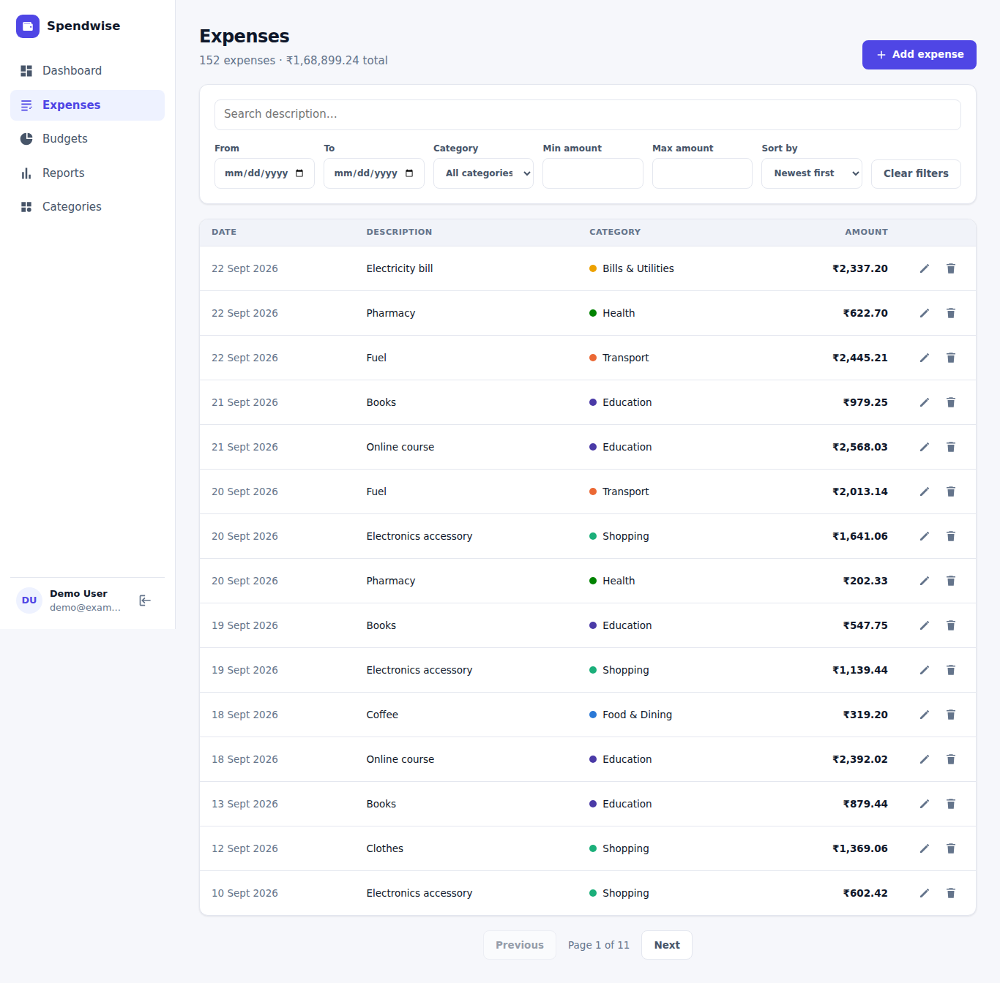
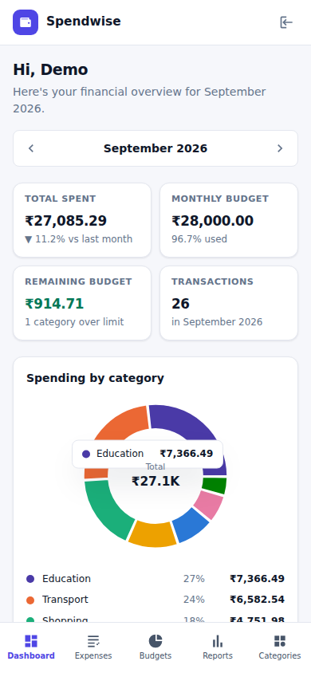
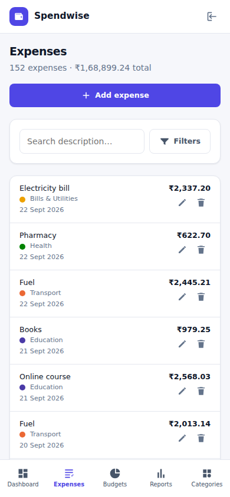
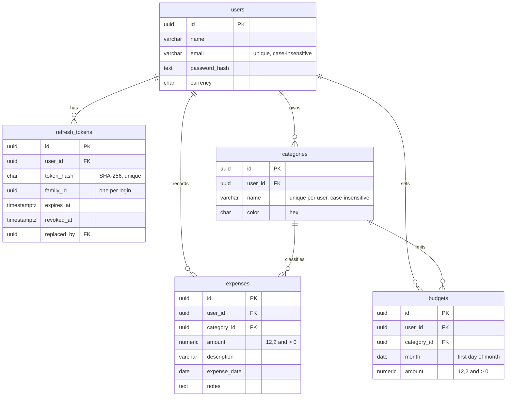

# Spendwise: Expense Tracker & Budget Management System

A full-stack app for tracking expenses, setting monthly budgets per category and exporting monthly or yearly reports.

- **Frontend:** React 19 + TypeScript (Vite), React Router, Axios, Recharts
- **Backend:** Node.js + Express 5 + TypeScript, Zod validation, JWT auth with refresh tokens
- **Database:** PostgreSQL (raw SQL through `node-postgres`, with versioned migrations, indexes and stored functions)
- **Tests:** Vitest + Supertest (API, incl. integration tests against a real database), Vitest + Testing Library (UI)

| Dashboard | Reports |
| --- | --- |
|  |  |
| **Budgets** | **Expenses** |
|  |  |

<p>
  
  &nbsp;
  
</p>

---

## Features

| Area | What you can do |
| --- | --- |
| **Authentication** | Register and log in. Short-lived JWT access tokens plus rotating refresh tokens in an httpOnly cookie, so sessions survive a page reload. Includes logout. |
| **Dashboard** | See the month's total spend, total budget, what's left, how many categories went over their limit, and the change from last month. Includes a category breakdown (donut chart), a 6-month trend, per-category budget progress and recent expenses. Any month can be selected. |
| **Expenses** | Add, edit and delete expenses. Filter by **date range**, **category** and **min/max amount**, search descriptions, and sort by date or amount. Results are paginated and show the total of the filtered set. |
| **Budgets** | Set, edit and delete **monthly limits per category**. Progress bars turn amber at 80% and red when over the limit. You can copy last month's budgets in one click. |
| **Categories** | Eight default categories are created for every new user. You can add, rename or recolor them. A category that still has expenses can't be deleted. |
| **Reports** | Monthly and yearly reports with charts (daily or monthly spending, share per category, top expenses). Export as **CSV** or **Excel (.xlsx)**. The Excel file has Summary, By Category, By Day/Month and Expenses sheets. |
| **Responsive** | Desktop gets a sidebar. Mobile gets a top bar and bottom tab bar, tables turn into cards, filters collapse behind a toggle, and dialogs open as bottom sheets. |

---

## Quick start

### Prerequisites

- Node.js **20+** (developed on 22)
- PostgreSQL **14+**, or Docker to run the included `docker-compose.yml`

### 1. Start PostgreSQL

```bash
docker compose up -d
```

This starts Postgres 16 on `localhost:5432` with user/password `expense`/`expense`. It creates two databases: `expense_tracker` for the app and `expense_tracker_test` for the tests.

<details>
<summary>Using an existing PostgreSQL instead</summary>

```sql
CREATE USER expense WITH PASSWORD 'expense';
CREATE DATABASE expense_tracker OWNER expense;
CREATE DATABASE expense_tracker_test OWNER expense;
```

The first migration runs `CREATE EXTENSION pgcrypto` (for `gen_random_uuid()`), so the user needs permission to create extensions. The simplest way is to make it the database owner, as above.

</details>

### 2. Backend

```bash
cd backend
cp .env.example .env      # adjust if needed
npm install
npm run migrate           # creates tables, indexes and functions
npm run seed              # optional: demo account with 6 months of data
npm run dev               # http://localhost:4000
```

### 3. Frontend

```bash
cd frontend
npm install
npm run dev               # http://localhost:5173
```

Open http://localhost:5173. Create an account, or sign in with the seeded demo account:

> **Email:** `demo@example.com` &nbsp;·&nbsp; **Password:** `Demo@1234`

In development, Vite proxies `/api` to `http://localhost:4000`. Both apps share an origin, so the refresh cookie works without any CORS setup.

---

## Running the tests

```bash
# Backend: unit + integration tests (needs the expense_tracker_test database)
cd backend && npm test

# Frontend: component, hook and utility tests (jsdom)
cd frontend && npm test
```

| Suite | Covers |
| --- | --- |
| `backend/tests/unit` | Validation schemas, date helpers, JWT and refresh-token helpers, SQL filter builder, CSV escaping and formula-injection protection, error-to-HTTP mapping |
| `backend/tests/integration` | Full HTTP flows against PostgreSQL: registration and login, refresh-token rotation and **reuse detection**, logout, expense CRUD and every filter, **data isolation between users**, category rules, budget CRUD, uniqueness and copy, dashboard numbers, yearly report, CSV/XLSX export |
| `frontend/src/test` | Expense form validation and submission, login page flows, registration validation, `useAsync` (incl. ignoring stale responses) and `useDebounce`, and the Axios interceptor (**one refresh for many concurrent 401s**, session-expiry handling) |

A GitHub Actions workflow (`.github/workflows/ci.yml`) runs type checks, both test suites and both builds on every push. The backend job uses a PostgreSQL service container.

---

## Project structure

```
├── backend
│   ├── src
│   │   ├── app.ts                 # Express app: middleware + routers
│   │   ├── server.ts              # Entry point: runs migrations, starts server
│   │   ├── config/env.ts          # Zod-validated environment variables
│   │   ├── db/
│   │   │   ├── pool.ts            # pg pool + withTransaction() helper
│   │   │   ├── migrate.ts         # Tiny migration runner (schema_migrations table)
│   │   │   ├── seed.ts            # Demo data
│   │   │   └── migrations/        # 001_schema.sql, 002_functions.sql
│   │   ├── middleware/            # auth, validate, errorHandler
│   │   ├── modules/               # Feature modules: routes → service → SQL
│   │   │   ├── auth/  expenses/  budgets/  categories/  dashboard/  reports/
│   │   └── utils/                 # AppError, tokens, dates, shared zod schemas
│   └── tests/{unit,integration}
├── frontend
│   └── src
│       ├── api/                   # Axios client (token refresh) + typed endpoints
│       ├── context/               # AuthContext, ToastContext
│       ├── hooks/                 # useAuth, useAsync, useDebounce, useCategories, ...
│       ├── components/            # layout/, ui/, expenses/, budgets/, charts/
│       ├── pages/                 # Login, Register, Dashboard, Expenses, Budgets, Reports, Categories
│       ├── types/                 # Shared TypeScript interfaces
│       ├── utils/                 # Formatting, error helpers, file download
│       └── test/
├── docker-compose.yml
└── .github/workflows/ci.yml
```

---

## Database design



**Constraints and integrity**

- Money is stored as `NUMERIC(12,2)`, never as floating point. `CHECK` constraints keep amounts positive and budget months on the first day of the month.
- **Composite foreign keys** `(category_id, user_id) → categories(id, user_id)` make it impossible at the database level for an expense or budget to point at another user's category.
- `ON DELETE RESTRICT` from expenses to categories: a category with expenses can't be deleted (the API returns 409). Budgets cascade with their category. Everything cascades when a user is deleted.
- `UNIQUE (user_id, month, category_id)` allows one budget per category per month.
- Triggers keep `updated_at` current.

**Indexes** (all chosen for the queries the app actually runs)

| Index | Used by |
| --- | --- |
| `expenses (user_id, expense_date DESC)` | Expense list (default sort), date filters, reports, trend |
| `expenses (user_id, category_id, expense_date)` | Category filter, budget vs. actual, per-category totals |
| `budgets UNIQUE (user_id, month, category_id)` | Budgets for a month, uniqueness |
| `users UNIQUE (lower(email))` | Case-insensitive login |
| `categories UNIQUE (user_id, lower(name))` | Duplicate-name check |
| `refresh_tokens (token_hash)`, `(family_id)`, `(user_id)` | Refresh lookup, family revocation |

**Stored functions** (`002_functions.sql`)

- `fn_budget_summary(user, month)`: budget vs. spending per category for a month, including unbudgeted categories that have spending. It powers the dashboard.
- `fn_monthly_totals(user, year)`: a zero-filled total for each of the 12 months, for yearly reports.
- `fn_category_totals(user, from, to)`: spending per category over any date range, for reports.

**Transactions** are used where several writes must succeed or fail together:

- **Registration:** the user, the 8 default categories and the first refresh token.
- **Token refresh:** lock the token row (`SELECT … FOR UPDATE`), issue the new token and revoke the old one, or revoke the whole family on reuse.
- **Copy budgets:** copy a month's limits to another month (`INSERT … SELECT … ON CONFLICT`).
- **Migrations:** each file is applied together with its bookkeeping row.

**Query performance:** the list endpoint fetches the page of rows and the filtered count and sum in parallel. Aggregations happen in SQL, not in JavaScript. `LEFT JOIN LATERAL` computes spending per budget in one round trip. Every query is parameterized, and `ORDER BY` columns come from a whitelist.

---

## Authentication flow

```
Login / Register ──► { accessToken (15 min JWT) } in JSON
                     + refresh_token (random 48 bytes, 7 days) as an httpOnly, SameSite cookie on /api/auth

API call ──► Authorization: Bearer <accessToken>
   └─ 401? ──► POST /api/auth/refresh (cookie) ──► new access token + NEW refresh token (rotation)
                                                  └─► the original request is retried automatically
Page reload ──► POST /api/auth/refresh restores the session (persistent login)
```

- The **access token is kept in memory only** (not `localStorage`), so an XSS bug can't persist it. The **refresh token is httpOnly**, so JavaScript can't read it at all.
- Refresh tokens are **stored hashed** (SHA-256) and **rotated on every use**. Presenting an already-used token is treated as theft, and every token from that login is revoked.
- The frontend **deduplicates refreshes**: when several requests get a 401 at the same moment, they all wait on a single `/auth/refresh` call. Without this, parallel refreshes would trip the reuse detection.
- Passwords are hashed with bcrypt. Login takes the same time whether or not the e-mail exists, and the credential endpoints are rate-limited.

---

## API reference

All endpoints are prefixed with `/api`. Everything except `auth/register|login|refresh|logout` and `health` requires `Authorization: Bearer <token>`.

| Method | Endpoint | Description |
| --- | --- | --- |
| `POST` | `/auth/register` | `{ name, email, password }` → `201 { user, accessToken }` and sets the refresh cookie |
| `POST` | `/auth/login` | `{ email, password }` → `{ user, accessToken }` and sets the refresh cookie |
| `POST` | `/auth/refresh` | Uses the cookie → `{ user, accessToken }` and a rotated cookie |
| `POST` | `/auth/logout` | Revokes the refresh token → `204` |
| `GET` | `/auth/me` | Current user |
| `GET` | `/expenses` | Query: `from`, `to` (YYYY-MM-DD), `categoryId`, `minAmount`, `maxAmount`, `search`, `sortBy` (`date`\|`amount`\|`createdAt`), `order`, `page`, `limit` (≤100) → `{ data, pagination, totalAmount }` |
| `GET` | `/expenses/:id` | One expense |
| `POST` | `/expenses` | `{ amount, description, categoryId, expenseDate, notes? }` → `201` |
| `PUT` | `/expenses/:id` | Any subset of the fields above |
| `DELETE` | `/expenses/:id` | `204` |
| `GET` | `/budgets?month=YYYY-MM` | Budgets with `spent`, `remaining`, `percentUsed` |
| `POST` | `/budgets` | `{ categoryId, month: "YYYY-MM", amount }` → `201`, or `409` if one already exists |
| `PUT` | `/budgets/:id` | `{ amount }` |
| `DELETE` | `/budgets/:id` | `204` |
| `POST` | `/budgets/copy` | `{ fromMonth, toMonth, overwrite? }` → `{ copied }` |
| `GET` / `POST` | `/categories` | List (with expense counts) / create `{ name, color }` |
| `PUT` / `DELETE` | `/categories/:id` | Update / delete (`409` if it still has expenses) |
| `GET` | `/dashboard?month=YYYY-MM` | Totals, per-category budget summary, 6-month trend, recent expenses |
| `GET` | `/reports?period=monthly&year=2026&month=9` | Report data (`period=yearly` needs no `month`) |
| `GET` | `/reports/export?…&format=csv\|xlsx` | File download |
| `GET` | `/health` | Liveness and database check |

**Errors** always have the same shape, with HTTP status codes 400, 401, 404, 409, 429 and 500:

```json
{
  "error": {
    "code": "BAD_REQUEST",
    "message": "Validation failed",
    "details": [{ "field": "amount", "message": "Amount must be greater than 0" }]
  }
}
```

---

## Environment variables

**Backend** (`backend/.env`, see `.env.example`). All variables are validated at startup, and the server refuses to start if any is invalid.

| Variable | Default | Notes |
| --- | --- | --- |
| `DATABASE_URL` | – | PostgreSQL connection string |
| `DATABASE_SSL` | `false` | Set `true` for hosted Postgres (Render, Neon, Supabase…) |
| `JWT_ACCESS_SECRET` | – | At least 32 characters |
| `JWT_ACCESS_EXPIRES_IN` | `15m` | Access-token lifetime |
| `REFRESH_TOKEN_TTL_DAYS` | `7` | Refresh-token lifetime |
| `CORS_ORIGINS` | `http://localhost:5173` | Comma-separated list of allowed frontend origins |
| `COOKIE_SAMESITE` / `COOKIE_SECURE` | `lax` / `false` | Use `none` / `true` when frontend and API are on different domains |
| `PORT` | `4000` | |
| `BCRYPT_ROUNDS` | `12` | |

**Frontend** (`frontend/.env`): `VITE_API_URL`, defaults to `/api`.

---

## Deployment

The app deploys as three pieces: a managed PostgreSQL database, the API on a Node host, and the static frontend.

1. **Database:** create a PostgreSQL instance (Render, Neon, Supabase, Railway…) and copy its connection string.
2. **API** (e.g. a Render *Web Service* with root directory `backend`):
   - Build command: `npm ci && npm run build`
   - Start command: `npm start` (migrations run automatically on startup)
   - Environment: `NODE_ENV=production`, `DATABASE_URL`, `DATABASE_SSL=true`, a random `JWT_ACCESS_SECRET` (e.g. `openssl rand -hex 64`), `CORS_ORIGINS=https://<your-frontend-domain>`, `COOKIE_SAMESITE=none`, `COOKIE_SECURE=true`
3. **Frontend** (e.g. Vercel or Netlify with root directory `frontend`):
   - Build command: `npm run build`, output directory `dist`
   - Environment: `VITE_API_URL=https://<your-api-domain>/api`
   - `vercel.json` already rewrites all routes to `index.html` for client-side routing.

---

## Design decisions

- **Raw SQL over an ORM.** The assignment asks for a SQL schema with transactions, indexes and stored procedures. Plain SQL migrations with `node-postgres` keep all of that explicit and reviewable. A small `withTransaction()` helper handles BEGIN, COMMIT and ROLLBACK.
- **Feature modules** (`routes → service`). Routes handle HTTP concerns and validation, and services hold the business logic and SQL. Services can be tested directly.
- **Validation at the edge.** Every body, query string and path parameter goes through a Zod schema in the `validate()` middleware. Handlers only see parsed, typed data (e.g. amounts are coerced to numbers, e-mails normalized). The database constraints are a second line of defence, and their errors map to readable 4xx responses.
- **No global state library.** Server data is loaded through a small `useAsync` hook (with stale-response protection), auth and toasts live in React Context, and filters are local state with `useDebounce`. That is enough for an app this size and keeps the hooks easy to follow.
- **Accessible, colorblind-safe charts.** Default category colors come from a palette checked for color-vision deficiency. Every chart has a legend or table that lists the values, so no information depends on color or hover alone.
